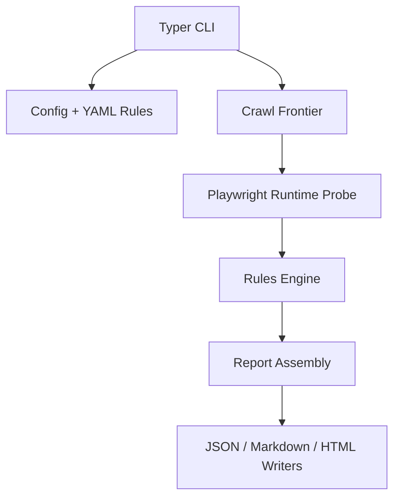
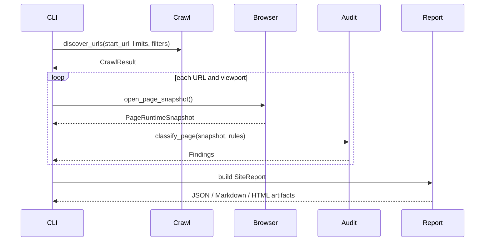

# Architecture

## Overview

The codebase is split into clear runtime layers so crawl logic, browser collection, rules evaluation, and report generation remain independent and testable.

## Layer responsibilities

| Layer | Responsibility |
| --- | --- |
| `cli.py` | Parses CLI options, merges config, writes artifacts, returns exit codes |
| `crawl/` | Normalizes URLs, discovers same-origin pages, parses `sitemap.xml`, applies include/exclude filters |
| `browser/` | Loads pages with Playwright, records font requests, extracts visible text and CSS font-face rules |
| `audit/` | Maps runtime observations to deterministic findings using the YAML rules bundle |
| `reporting/` | Produces JSON, Markdown, and HTML artifacts |
| `models/` | Typed contracts for config, runtime snapshots, findings, crawl results, and reports |
| `rules/` | Bundled YAML source of truth for approved families, mappings, fallbacks, vendors, and locale review |

## Runtime data flow

## Determinism choices

- Breadth-first crawl order
- Same-origin restriction
- Bounded crawl and sitemap response sizes
- Configurable page and depth caps
- Stable URL normalization and deduplication
- Stable finding IDs derived from finding content
- Typed models at every stage
- YAML rules loaded before the scan starts

## Runtime probe contents

The Playwright probe returns:

- visible text elements with computed `font-family`, `font-weight`, and `font-style`
- selector, tag, classes, inline style, and bounding box
- accessible runtime `@font-face` rules from the CSSOM
- same-origin font asset requests recorded during page load

## Reporting model

The final `SiteReport` includes:

- crawl summary
- page coverage summary
- flat finding list
- recommended approved-family replacements
- `<head>` loading requirements
- manual-review buckets
- unresolved non-CSS runtime issues

## Intentional v1 boundaries

- No source rewriting
- No authenticated session management
- No CMS-specific connectors
- No heuristic or AI-driven classification

## Security notes

- Crawl discovery is bounded by response-size caps before parsing.
- HTML reports are rendered with autoescaping and a restrictive CSP.
- Consent-management UI is treated as browser chrome, not site typography evidence.
