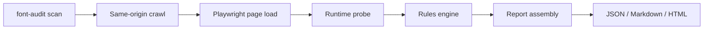

# font-audit-crawler

`font-audit-crawler` is a deterministic Playwright-based crawler for runtime font compliance audits and font remediation QA. The engine is intentionally AI-free at runtime and enforces a rules contract derived from the repository `AGENTS.md`.

## Core use case

Use this tool when a typography remediation project needs runtime proof instead of source-only confidence. It is built to answer questions like:

- Are any non-approved families still visible at runtime?
- Are theme-owned font files still being loaded from same-origin paths?
- Do fallback stacks still leak `Arial`, `Helvetica`, `Segoe UI`, or similar families into QA tooling?
- Are inline or template-level leftovers still visible?
- Which pages contain vendor or locale-specific manual-review cases?

## Highlights

| Capability | Included |
| --- | --- |
| Same-origin crawl with sitemap support | Yes |
| Playwright runtime inspection | Yes |
| Visible text extraction | Yes |
| Runtime `@font-face` detection | Yes |
| Same-origin font asset request detection | Yes |
| YAML-driven rules | Yes |
| JSON, Markdown, and HTML reports | Yes |
| Fixture-backed integration and e2e tests | Yes |
| Auto-remediation patches | No |

## Scan pipeline

## Design goals

- Deterministic behavior and stable outputs
- High-signal runtime evidence for QA teams
- Configurable rules without recompiling the tool
- Useful reports, not demo-only artifacts
- Clean Python package layout with strong typing and tests
- Secure-by-default operator workflow with no AI runtime surface

## Next reading

- [Architecture](architecture.md)
- [CLI](cli.md)
- [Rules Engine](rules-engine.md)
- [Reports](reports.md)
- [Security](security.md)
- [Testing](testing.md)
