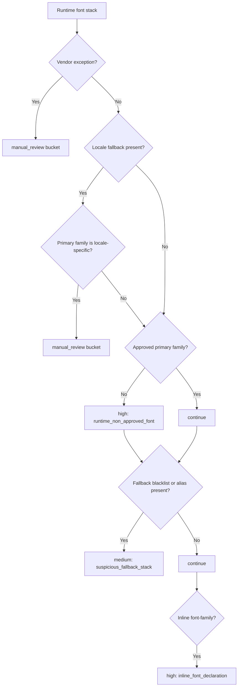

# Rules Engine

The rules engine is deterministic and YAML-driven. It does not attempt heuristic or AI-based classification.

## Rule sources

| File | Purpose |
| --- | --- |
| `approved_fonts.yaml` | Approved families plus Google-hosting metadata |
| `mappings.yaml` | Explicit mappings, default replacement, condensed replacement |
| `fallback_blacklist.yaml` | Disallowed fallback families and suspicious aliases |
| `vendor_exceptions.yaml` | Vendor/widget exception families and selector keywords |
| `locale_fallbacks.yaml` | Locale-specific families and fallback chains that require review |

## Runtime finding types

| Finding type | Severity | Trigger |
| --- | --- | --- |
| `runtime_non_approved_font` | High | Visible primary runtime family is not approved |
| `suspicious_fallback_stack` | Medium | Runtime stack still contains blacklisted fallbacks or suspicious aliases |
| `local_font_asset_loaded` | High | Same-origin font asset was requested at runtime |
| `local_css_font_face` | High | Runtime CSS exposes `@font-face`, same-origin font URLs, or data URIs |
| `inline_font_declaration` | High | Visible element contains inline `font-family` |
| `vendor_exception` | Manual review | Vendor/widget typography bucket |
| `locale_fallback_review` | Manual review | Locale-specific primary family or fallback chain detected |
| `page_load_error` | Medium | Page did not load cleanly enough for full runtime coverage |

## Mapping behavior

The recommendation logic follows the remediation contract in `AGENTS.md`:

- keep approved families
- map known fallbacks like `Helvetica` or `Arial` to `Roboto`
- map condensed or narrow families to `Roboto Condensed`
- default unknown non-approved families to `Roboto`
- preserve computed `font-weight` and `font-style` in recommendations

## Vendor and locale handling

Vendor and locale cases are intentionally not treated as normal remediation targets. They are separated into manual-review buckets so the report stays actionable without producing false remediation advice.

For example, if the runtime primary family is `Noto Sans JP`, the engine does not default to `Roboto`. It emits a locale manual-review finding instead, because replacing a script-specific family with a Latin-default family would be unsafe without explicit project guidance.

## Head requirements

The report builder converts approved-family observations and replacement recommendations into:

- required approved families
- Google-hosted family subset
- Google Fonts `<link>` snippet where possible
- explicit notes for approved non-Google families such as `NewHeroAccess`

## Decision flow

